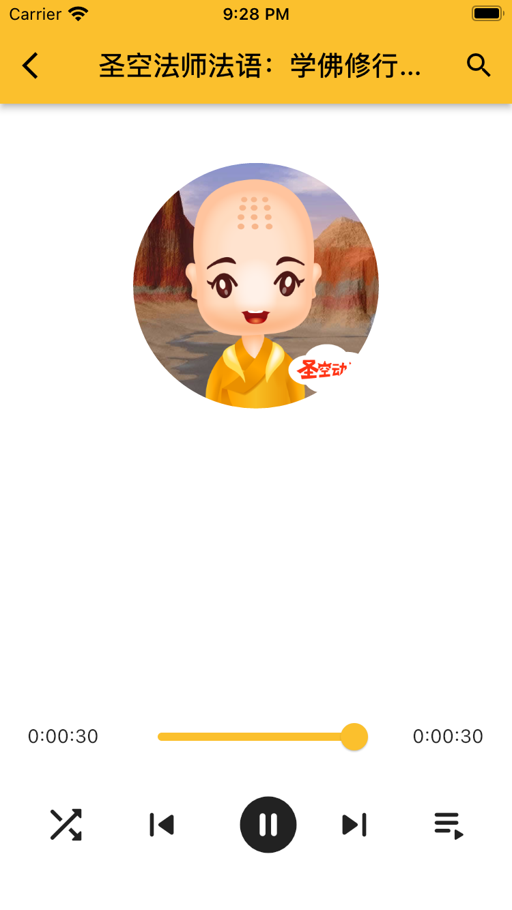

# fo

A Flutter side project for buddhist audios. Created by ChengFang Liu.
It is still under developing, have not published yet.
[official website](https://app.nowbaby.com) , the QR code on this page is not working yet.

## Features

- Register/Login by using SMS validation code
- Full Audio player (play, pause, forward, backward, repeat, playlist, etc)
- Audio playing in background
- Playing progress indicator
- Muliple language support

## Screenshots

- Full Audio player
  

## Technology stack

### Server Side

[Server Side Source Code](https://flutter.dev/docs/get-started/codelab)

- [Laravel](https://laravel.com)
- [TailwindCss](https://tailwindcss.com)

### Client/Mobile Side

[Client/Mobile Side Source Code]()

- [Flutter](https://flutter.dev)
