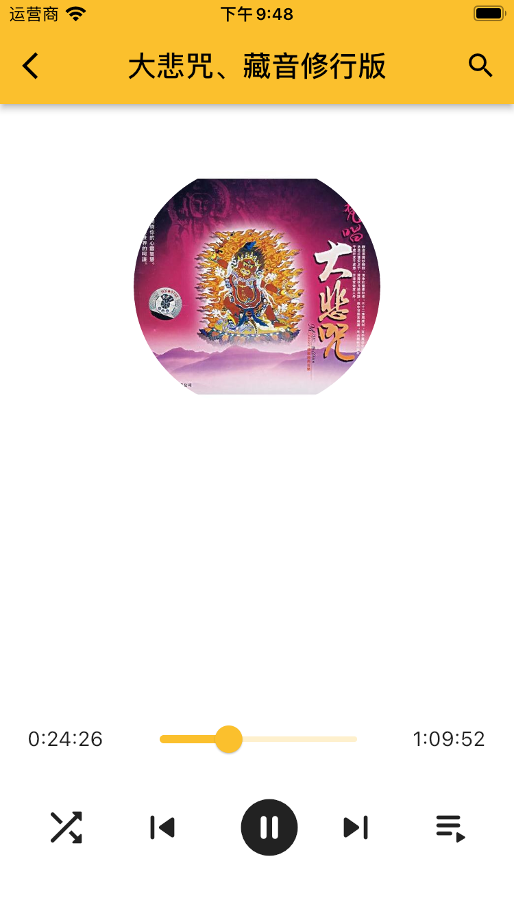

# fo

A Flutter side project for buddhist audios. Created by ChengFang Liu.
It is still under developing, have not published yet.
[official website](https://app.nowbaby.com) , the QR code on this page is not working yet.

## Features

- Register/Login by using SMS validation code
- Full Audio player (play, pause, forward, backward, repeat, playlist, etc)
- Audio playing in background
- Playing progress indicator
- Muliple language support

## Screenshots

<table>
  <tr>
    <td>Register/Login</td>
     <td>Player</td>
     <td>Home</td>
     <td>Category</td>
  </tr>
  <tr>
    <td></td>
    <td></td>
    <td></td>
    <td></td>
  </tr>
 </table>

<table>
  <tr>
    <td>Detail</td>
     <td>My Account</td>
     <td>Playing</td>
     <td>Progress</td>
  </tr>
  <tr>
    <td></td>
    <td></td>
    <td></td>
    <td></td>
  </tr>
 </table>

<table>
  <tr>
    <td>Search</td>
     <td>Search Result</td>
     <td>Playing</td>
     <td>Progress</td>
  </tr>
  <tr>
    <td></td>
    <td></td>
    <td></td>
    <td></td>
  </tr>
 </table>

## Technology stack

### Server Side

[Server Side Source Code](https://github.com/liucf/fo_server)

- [Laravel](https://laravel.com)
- [TailwindCss](https://tailwindcss.com)

### Client/Mobile Side

[Client/Mobile Side Source Code](https://github.com/liucf/fo_client_fultter)

- [Flutter](https://flutter.dev)
